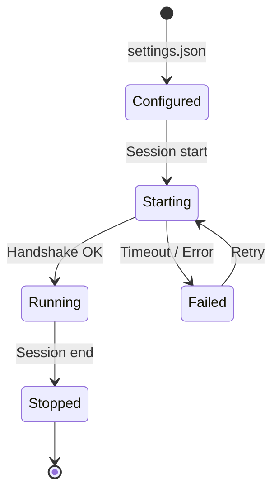

# API et intégrations

## API Anthropic (Claude)

Claude Code communique avec l'API Claude pour générer les réponses et exécuter les raisonnements.

### Configuration de base

```bash
export ANTHROPIC_API_KEY="sk-ant-api03-..."
export ANTHROPIC_BASE_URL="https://api.anthropic.com"  # Défaut
```

### Requête type envoyée par Claude Code

```http
POST /v1/messages HTTP/1.1
Host: api.anthropic.com
x-api-key: sk-ant-...
anthropic-version: 2023-06-01
anthropic-beta: interleaved-thinking-2025-05-14,context-1m-2025-08-07
Content-Type: application/json

{
  "model": "claude-opus-4-6",
  "max_tokens": 16384,
  "system": [
    {"type": "text", "text": "...", "cache_control": {"type": "ephemeral"}},
    {"type": "text", "text": "...contexte dynamique..."}
  ],
  "messages": [
    {"role": "user", "content": "Corrige le bug dans auth.ts"}
  ],
  "tools": [
    {
      "name": "Read",
      "description": "Reads a file from the local filesystem",
      "input_schema": {
        "type": "object",
        "properties": {
          "file_path": {"type": "string"},
          "offset": {"type": "number"},
          "limit": {"type": "number"}
        },
        "required": ["file_path"]
      }
    }
  ],
  "stream": true
}
```

### Betas utilisées

| Beta | Description |
|------|-------------|
| `interleaved-thinking-2025-05-14` | Pensée intercalée (chain-of-thought visible) |
| `context-1m-2025-08-07` | Contexte 1M tokens |
| `structured-outputs-2025-12-15` | Sorties structurées |
| `web-search-2025-03-05` | Recherche web native |
| `fast-mode-2026-02-01` | Mode inférence rapide |

### Headers personnalisés

```http
x-anthropic-billing-header: {
  "cc_version": "1.x.x",
  "cc_fingerprint": "...",
  "cc_entrypoint": "cli",
  "cc_workload": "interactive"
}
```

---

## Model Context Protocol (MCP)

MCP permet à Claude Code de se connecter à des serveurs d'outils tiers, étendant ses capacités au-delà des outils intégrés.

### Configuration d'un serveur MCP

Dans `~/.claude/settings.json` ou `.claude.json` (projet) :

```json
{
  "mcpServers": {
    "database": {
      "command": "npx",
      "args": ["-y", "@modelcontextprotocol/server-postgres"],
      "env": {
        "DATABASE_URL": "postgresql://localhost:5432/mydb"
      }
    },
    "github": {
      "command": "npx",
      "args": ["-y", "@modelcontextprotocol/server-github"],
      "env": {
        "GITHUB_TOKEN": "${GITHUB_TOKEN}"
      }
    }
  }
}
```

### Cycle de vie des serveurs MCP



Claude Code :
1. Démarre les serveurs MCP au lancement de la session
2. Découvre les outils via le protocole MCP
3. Ajoute les outils MCP au pool d'outils disponibles
4. Ferme les serveurs à la fin de la session

### Utilisation des outils MCP

Les outils MCP sont utilisés de façon transparente, exactement comme les outils intégrés :

```
Utilisateur : "Montre-moi les 10 dernières commandes dans la base"
→ Claude utilise l'outil MCP "database.query" automatiquement
```

### Ressources MCP

En plus des outils, MCP expose des ressources lisibles :

```
Utilisateur : "Lis le schéma de la table users"
→ Claude utilise ReadMcpResource pour lire la ressource
```

---

## Intégration GitHub

Claude Code utilise `gh` (GitHub CLI) pour toutes les opérations GitHub :

### Opérations supportées

```bash
# Pull Requests
gh pr create --title "..." --body "..."
gh pr list
gh pr view 123
gh pr merge 123

# Issues
gh issue create --title "..." --body "..."
gh issue list
gh issue view 456

# Actions / CI
gh run list
gh run view 789

# Reviews
gh pr review 123 --approve
gh api repos/owner/repo/pulls/123/comments
```

### Format de sortie

Claude Code formate les références GitHub en liens cliquables :

```
owner/repo#123  →  lien vers la PR/issue
```

---

## Intégration AWS Bedrock

```bash
export CLAUDE_CODE_USE_BEDROCK=1
export AWS_REGION=us-east-1
export AWS_ACCESS_KEY_ID=...
export AWS_SECRET_ACCESS_KEY=...
```

Claude Code route automatiquement les requêtes vers Bedrock au lieu de l'API directe Anthropic. Les mêmes modèles sont disponibles avec les identifiants Bedrock correspondants.

---

## Intégration Google Vertex AI

```bash
export CLAUDE_CODE_USE_VERTEX=1
export CLOUD_ML_REGION=us-central1
export GOOGLE_APPLICATION_CREDENTIALS=/path/to/credentials.json
```

---

## Schémas d'outils

### Schéma générique d'un outil

```typescript
interface ToolDefinition {
  name: string;
  description: string;
  inputSchema: {
    type: "object";
    properties: Record<string, PropertySchema>;
    required: string[];
  };
}

interface ToolResult {
  type: "tool_result";
  tool_use_id: string;
  content: string | ContentBlock[];
}
```

### Exemples de schémas

#### Read

```json
{
  "name": "Read",
  "input_schema": {
    "type": "object",
    "properties": {
      "file_path": {
        "type": "string",
        "description": "Chemin absolu du fichier"
      },
      "offset": {
        "type": "number",
        "description": "Ligne de début (optionnel)"
      },
      "limit": {
        "type": "number",
        "description": "Nombre de lignes (optionnel)"
      }
    },
    "required": ["file_path"]
  }
}
```

#### Bash

```json
{
  "name": "Bash",
  "input_schema": {
    "type": "object",
    "properties": {
      "command": {
        "type": "string",
        "description": "Commande à exécuter"
      },
      "timeout": {
        "type": "number",
        "description": "Timeout en ms (max 600000)"
      },
      "run_in_background": {
        "type": "boolean",
        "description": "Exécuter en arrière-plan"
      }
    },
    "required": ["command"]
  }
}
```

#### Edit

```json
{
  "name": "Edit",
  "input_schema": {
    "type": "object",
    "properties": {
      "file_path": {
        "type": "string",
        "description": "Chemin absolu du fichier"
      },
      "old_string": {
        "type": "string",
        "description": "Texte à remplacer (doit être unique)"
      },
      "new_string": {
        "type": "string",
        "description": "Texte de remplacement"
      },
      "replace_all": {
        "type": "boolean",
        "description": "Remplacer toutes les occurrences",
        "default": false
      }
    },
    "required": ["file_path", "old_string", "new_string"]
  }
}
```

---

## Agent SDK

Claude Code expose un SDK pour la création d'agents personnalisés :

```typescript
// Types disponibles dans entrypoints/agentSdkTypes.ts
import type { AgentConfig, AgentResult } from '@anthropic-ai/claude-code';

const config: AgentConfig = {
  model: 'claude-sonnet-4-6',
  tools: ['Read', 'Write', 'Bash'],
  systemPrompt: 'Tu es un agent de test.',
  maxTokens: 8192,
};
```

---

## Télémétrie

Claude Code envoie des événements de télémétrie via OpenTelemetry :

### Événements tracés

| Événement | Données |
|-----------|---------|
| Session start | Version, OS, modèle |
| Query | Tokens in/out, latence, coût |
| Tool use | Outil, durée, succès/échec |
| Error | Type, message, stack |
| Session end | Durée totale, coût total |

### Désactivation

```bash
export CLAUDE_CODE_DISABLE_TELEMETRY=1
```

---

## Suivi des coûts

Claude Code suit les coûts en temps réel via `cost-tracker.ts` :

```
Session cost: $0.42
├── Input tokens:  125,000 × $15/MTok  = $1.88
├── Output tokens:  8,500 × $75/MTok  = $0.64
└── Cache reads:   50,000 × $1.50/MTok = $0.08
    Total: $2.60
```

Les prix sont alignés sur la tarification publique d'Anthropic et mis à jour dans `utils/modelCost.ts`.
