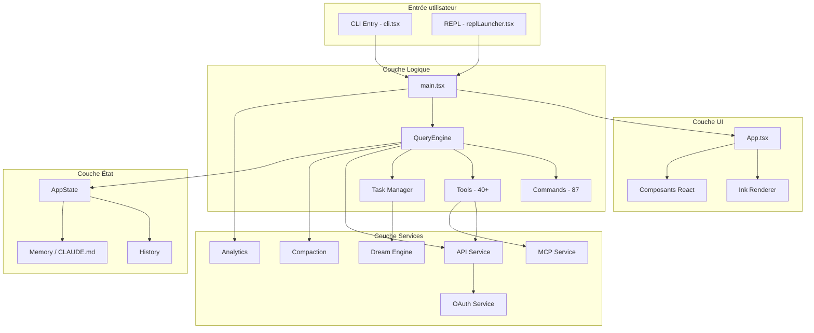
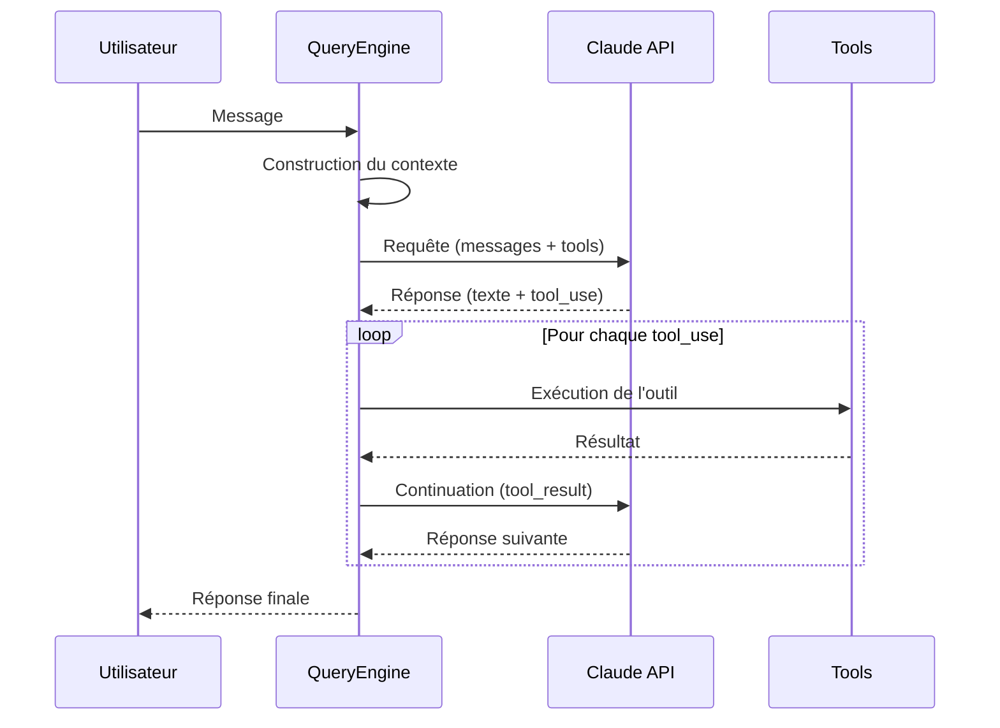
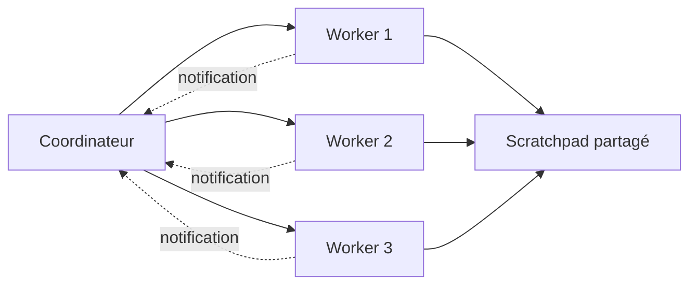
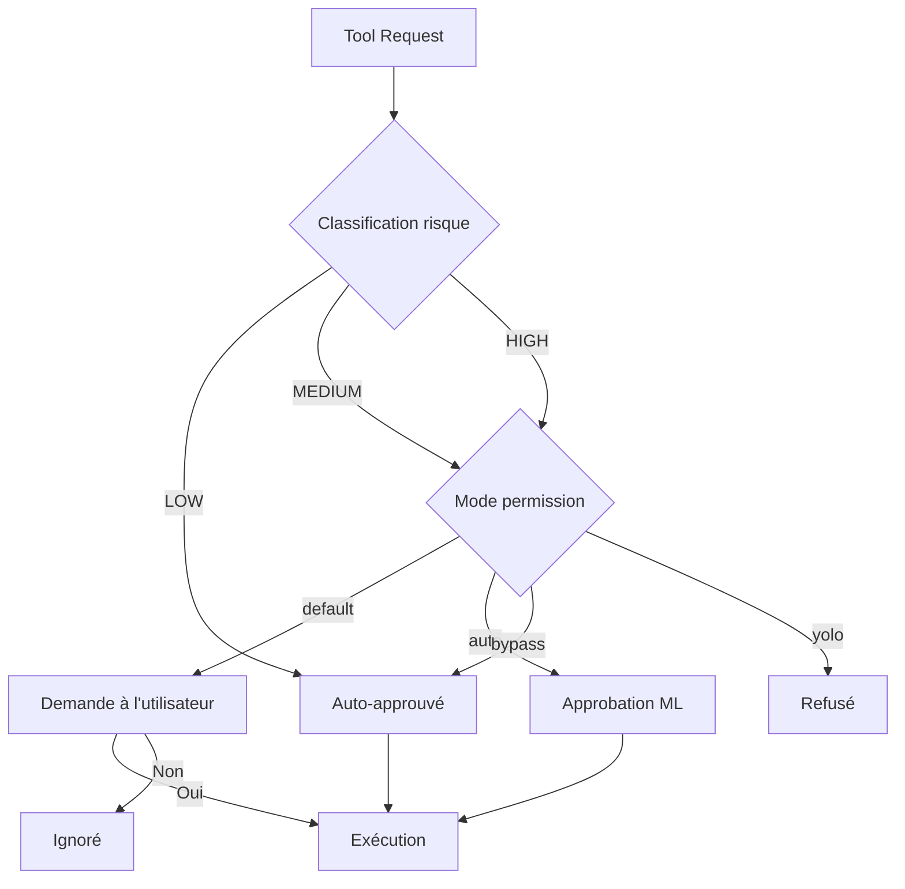
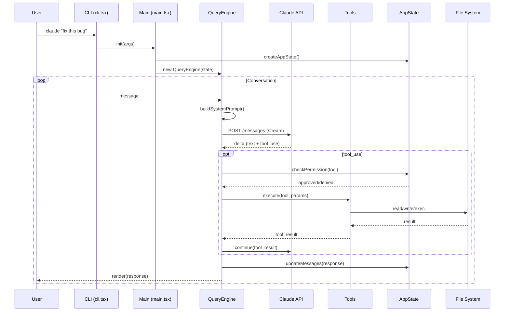

# Architecture

## Vue d'ensemble

Claude Code est une application CLI React/TypeScript structurée en couches : une interface terminal personnalisée, un moteur de requêtes conversationnel, un système d'outils extensible et des services backend modulaires.



---

## Modules principaux

### 1. Point d'entrée (`entrypoints/cli.tsx`)

Le bootstrap de l'application :

1. Validation de la version Node.js
2. Parsing des arguments CLI (Commander.js)
3. Initialisation de la télémétrie (OpenTelemetry)
4. Authentification (API key / OAuth)
5. Lancement du mode approprié (interactif, commande unique, daemon)

### 2. Boucle principale (`main.tsx`)

Fichier central (~4 700 lignes) qui orchestre :

- L'enregistrement des 87 commandes
- La construction du contexte système (git status, mémoire, fichiers du projet)
- La boucle de conversation (prompt → requête → réponse → affichage)
- La gestion du cycle de vie de la session

### 3. Moteur de requêtes (`QueryEngine.ts`)

Coeur de la logique conversationnelle :



**Responsabilités** :
- Assemblage du prompt système (sections cachées + dynamiques)
- Envoi des requêtes à l'API Claude
- Exécution des outils demandés par le modèle
- Gestion de la compaction automatique du contexte
- Suivi des coûts et tokens

### 4. Système d'outils (`Tool.ts`, `tools/`)

Chaque outil est défini par :

```typescript
interface Tool {
  name: string;
  description: string;
  inputSchema: ZodSchema;      // Schéma Zod des paramètres
  riskLevel: 'LOW' | 'MEDIUM' | 'HIGH';
  execute: (input: Input) => Promise<Result>;
}
```

**Outils intégrés** :

| Catégorie | Outils |
|-----------|--------|
| Fichiers | `Read`, `Write`, `Edit`, `Glob`, `Grep` |
| Shell | `Bash`, `PowerShell` |
| Web | `WebFetch`, `WebSearch` |
| Git/GitHub | Intégré via `Bash` + `gh` |
| Agents | `Agent` (spawn d'agents enfants) |
| Tâches | `TaskCreate`, `TaskUpdate`, `TaskGet`, `TaskList`, `TaskStop` |
| MCP | `MCPTool`, `ReadMcpResource` |
| Notebook | `NotebookEdit` |
| Navigation | `WebBrowser` (Computer Use) |
| Planification | `EnterPlanMode`, `ExitPlanMode` |
| Worktree | `EnterWorktree`, `ExitWorktree` |
| Cron | `CronCreate`, `CronDelete`, `CronList` |
| Skills | `Skill` (invocation de skills utilisateur) |

### 5. Gestion d'état (`state/`)

```
AppState (React Context)
├── messages[]          # Historique de conversation
├── tasks[]             # Tâches en cours
├── permissions{}       # État des permissions
├── settings{}          # Configuration active
├── costTracker{}       # Suivi des coûts
└── agentStates{}       # État des agents enfants
```

- État centralisé via React Context
- Mises à jour immuables
- Sélecteurs pour les données dérivées

### 6. Services (`services/`)

| Service | Rôle |
|---------|------|
| `api/claude.ts` | Client API Anthropic (retry, fallback, streaming) |
| `mcp/` | Gestion du cycle de vie des serveurs MCP |
| `oauth/` | Flow OAuth pour Claude Pro/Teams |
| `analytics/` | Télémétrie et feature flags (GrowthBook) |
| `autoDream/` | Consolidation mémoire en arrière-plan |
| `compact/` | Stratégies de compaction du contexte |
| `plugins/` | Chargement et exécution des plugins |
| `lsp/` | Intégration Language Server Protocol |
| `voice.ts` | Saisie vocale (STT) |

---

## Patterns architecturaux

### 1. Feature Gating (Dead Code Elimination)

```typescript
import { feature } from 'bun:bundle';

// Éliminé du build si le flag est désactivé
if (feature('COORDINATOR_MODE')) {
  const coordinator = await import('./coordinator/coordinatorMode.js');
  coordinator.init();
}
```

Ce pattern permet à Anthropic de maintenir une seule base de code avec des builds distincts :
- **Build public** : fonctionnalités stables uniquement
- **Build interne** : toutes les fonctionnalités expérimentales

### 2. Prompt système modulaire

Le prompt système est construit à partir de sections cachées (stables, mises en cache côté API) et de sections dynamiques (contexte de session) :

```
┌─────────────────────────────┐
│  Sections cachées (cached)  │  ← Mises en cache par l'API
│  - Rôle et comportement     │
│  - Instructions sécurité    │
│  - Descriptions d'outils    │
├─────────────────────────────┤
│  SYSTEM_PROMPT_DYNAMIC_     │  ← Frontière
│  BOUNDARY                   │
├─────────────────────────────┤
│  Sections dynamiques        │  ← Régénérées à chaque requête
│  - Git status               │
│  - Fichiers CLAUDE.md       │
│  - Mémoire utilisateur      │
│  - Date, OS, shell          │
└─────────────────────────────┘
```

### 3. Orchestration multi-agents



- Le coordinateur distribue les tâches aux workers
- Chaque worker est un agent autonome avec son propre contexte
- Communication via système de notifications et scratchpad fichier partagé
- Attribution de couleurs pour distinction visuelle

### 4. Compaction du contexte

Quand la conversation approche la limite de tokens :

```
1. Détection du seuil (tokenBudget.ts)
2. Sélection de la stratégie :
   ├── Résumé des messages anciens
   ├── Snipping des tool_use verbeux
   ├── Micro-compaction (suppression sélective)
   └── Context collapse (ultra-large contexts)
3. Remplacement des messages originaux par le résumé
4. Continuation transparente de la conversation
```

### 5. Système de permissions



Protections supplémentaires :
- Liste de fichiers protégés (`.gitconfig`, `.bashrc`, etc.)
- Prévention de traversée de chemin (Unicode, backslash, case-sensitivity)
- Validation des commandes shell dangereuses

### 6. Consolidation mémoire (Dream)

Processus en arrière-plan qui optimise la mémoire persistante :

```
Déclencheurs (3 gates) :
  1. Temporel : >24h depuis le dernier dream
  2. Sessions : >5 sessions depuis le dernier dream
  3. Lock : pas d'autre dream en cours

Phases :
  1. Orient   → Lecture du MEMORY.md actuel
  2. Gather   → Collecte des nouvelles informations
  3. Consolidate → Fusion et mise à jour
  4. Prune    → Suppression des entrées obsolètes
                 (maintien <200 lignes, <25KB)
```

---

## Renderer terminal personnalisé (`ink/`)

Claude Code n'utilise pas Ink directement mais implémente son propre renderer React pour le terminal :

```
ink/
├── dom.ts              # Abstraction DOM-like pour le terminal
├── output.ts           # Gestion de la sortie ANSI
├── layout/             # Moteur de layout (Yoga / Flexbox)
├── render-*.ts         # Logique de rendu
├── termio/             # I/O terminal bas niveau
└── reconciler.ts       # Réconciliation React
```

Ce renderer permet :
- Layout Flexbox via Yoga
- Composants React réactifs dans le terminal
- Animations fluides (spinners, progress bars)
- Gestion avancée de la couleur et du style ANSI

---

## Flux de données complet


